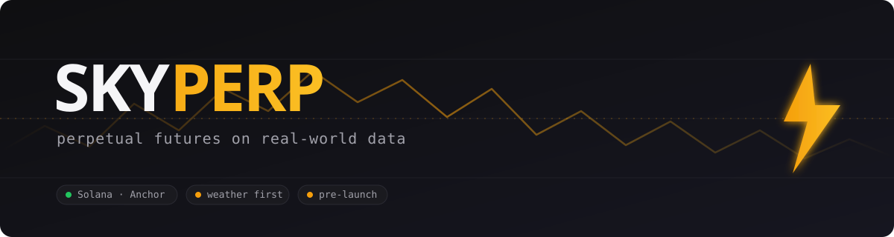

 

**Perpetual futures on real-world data. Trade the magnitude, not the yes/no.**

Prediction markets give you a binary: yes or no, fixed payout, then the market is gone. Skyperp gives you continuous scalar pricing, leverage, and no expiry. Trade the degree-by-degree forecast, hold as long as you want, size your conviction.

The first market is weather: the 7-day-out maximum-temperature anomaly at major US cities, on Solana. The construction generalizes to any continuous real-world index.

 

---

## The idea in one picture

A prediction market asks *"will NYC hit 100°F next Tuesday?"* and pays $1 or $0 on a fixed date. Skyperp lists *"NYC 7-day forecast is +5.2°F above normal"* and lets you go long or short at any level, $10 per degree per contract, with no resolution event. Funding-rate carry replaces settlement.

| | Prediction market | Skyperp |
|---|---|---|
| Outcome | binary (yes / no) | continuous (every degree is a price) |
| Payout | fixed at resolution | linear, $X per degree, mark-to-market |
| Horizon | dies on event date | rolling, never resolves |
| Position | one-shot bet | leveraged, hold and adjust indefinitely |

## Why this matters

Real-world outcomes are not yes/no. The temperature is not "hot or not", it is a number. So is rainfall, wind, power load, an economic print. Binary markets throw away the magnitude. Skyperp prices the magnitude and makes it continuously tradable, the way perps did for crypto spot.

Weather is the wedge: liquid public data, an obvious hedging audience, and a 26-year precedent for weather as a tradable commodity. The substrate is the product.

## What's here

- [`docs/how-it-works.md`](docs/how-it-works.md) — the mechanism in plain English: the anomaly index, the rolling horizon, how price stays honest without an expiry
- [`docs/faq.md`](docs/faq.md) — the questions people actually ask
- [`research/tradability.md`](research/tradability.md) — a backtest showing the index is genuinely tradable: enough movement, mean-reverting, no dead zones
- [`site/`](site/) — the landing page

## Status

Pre-launch. Validation and protocol design are done; a proof-of-concept on Solana devnet is next. Building deliberately.

Interested as a trader, a hedger, a market maker, or just want to argue about the mechanism? Open an issue or reach out: **[@thobothehobo](https://twitter.com/thobothehobo)** · sohanshingade@gmail.com

---

Skyperp · perpetual futures on real-world data

