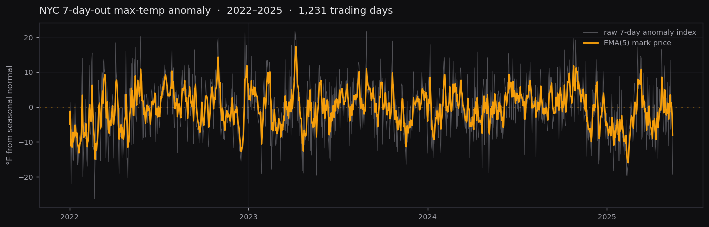

# Is the underlying actually tradable?

Before building a market on something, you have to prove the something moves the right amount. A tradable index needs enough volatility to be interesting, enough mean-reversion that it does not run away, and no long dead stretches where nothing happens. We backtested the NYC 7-day-out max-temperature anomaly against real forecast data to check.

## The data

- **1,231 trading days**, 2022 through 2025
- Source: GFS 00Z forecasts (NOAA), against NOAA 1991–2020 climate normals
- The index is the 7-day-out forecast high minus the seasonal normal for that day
- Mark price modeled as a short EMA of the index, smoothing single-run forecast noise

## The shape

The grey line is the raw anomaly, the amber line is the smoothed mark. The series oscillates around zero (the dashed line), swinging both warm and cold, and keeps coming back. That is the signature of a tradable, mean-reverting series rather than a trending or dead one.

## What we found

| Property | Result | What it means |
|---|---|---|
| Daily volatility (smoothed mark) | ~2.4°F | Real movement every day, not so violent it is unmanageable |
| Mean reversion | strong, no runaway | The index returns toward normal; it does not trend off to infinity |
| Tail behavior | thin-tailed, near-Gaussian | No fat-tailed blowups that would cascade liquidations |
| Dead regimes (stuck flat 30+ days) | none | The market never goes quiet for long stretches |
| Largest single-day move | ~3 sigma | No outlier days that break margin assumptions |
| Climate drift over the window | not significant | The series is stationary enough to model |

## The takeaway

The 7-day anomaly behaves like a well-conditioned tradable instrument: it moves enough to be worth trading, reverts enough to anchor a funding mechanism, and has no degenerate regimes or fat tails that would make it dangerous to margin. It looks more like a clean mean-reverting rate than like a meme coin.

One honest caveat: the raw index is volatile, and the smoothing step (the EMA mark) is what brings volatility into a comfortable band. That smoothing is part of the design, not a post-hoc fix. The interactive analysis, raw data, and full statistical write-up live in the private research repo.
